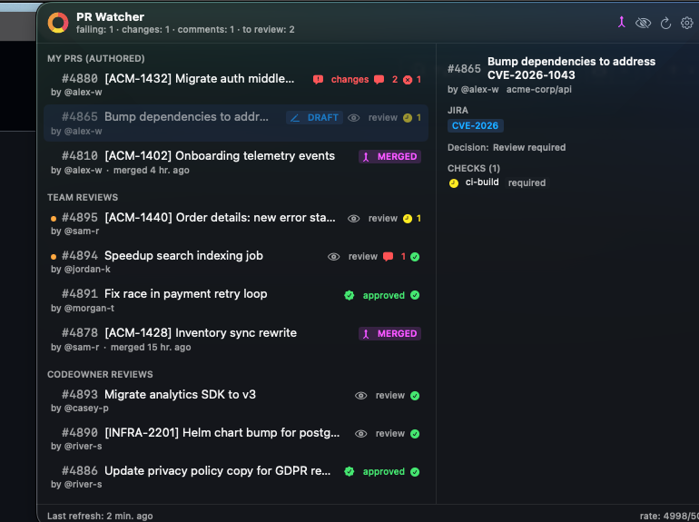

# PR Watcher

> A macOS menu bar app that keeps tabs on your GitHub pull requests so you don't have to.

<p align="center">
  
</p>

Three sections, sorted by urgency:

- **MY PRs (AUTHORED)** — PRs you opened. Are reviews back? Did CI go green? Did someone reply to your comment? You see it.
- **TEAM REVIEWS** — PRs your teammates need eyes on. Awaits-me rows float to the top with an orange dot prefix.
- **CODEOWNER REVIEWS** — everything else where you're a requested reviewer. Lower priority.

For each PR, in one row: review verdict, unresolved threads (split by whose court the ball is in), CI status (failing / pending / passing, required-vs-optional marked), draft / merged badges, and clickable JIRA + Figma links. Hover any row to open the details pane on the right.

The menu bar shows the same info in 16 pixels:


- 🟢 / 🟡 / 🔴 dot = overall status.
- Inline `❌ 1`, `❗ 2`, `💬 3`, `👁 4` badges = count of failing-CI / changes-requested / comments-waiting / PRs-awaiting-your-review.

---

## Install

```sh
brew install --cask wedkarz/pr-watcher/pr-watcher
```

That single line taps `wedkarz/homebrew-pr-watcher`, fetches the **signed and notarized** macOS app, and copies it to `/Applications`. macOS Gatekeeper accepts it on first open — no right-click-bypass needed.

**Prerequisites** — only one, and the setup wizard offers to install it for you on first launch:

```sh
brew install gh
gh auth login -s repo,read:org
```

---

## First launch

The first time you open PR Watcher, the **setup wizard** appears in a window (no menu-bar hunt required). It walks through:

1. **Prerequisites** — checks `gh` is installed and your token has `repo` + `read:org`. If anything's missing, a button next to the status opens Terminal pre-loaded with the right command (`brew install gh && gh auth login -s repo,read:org`, or `gh auth refresh -s repo,read:org`). You finish in Terminal, click **Recheck**, and you're moving.
2. **GitHub username** — auto-detected from `gh auth`. Editable.
3. **Repositories to track** — picked from a list of repos you actually have access to (`GET /user/repos`). Searchable. Multi-select.
4. **Your team(s)** — picked from `GET /user/teams`. The first team you select drives the *Team Reviews* bucket.
5. **JIRA** *(optional)* — auto-suggested URL based on your repo's organization (`https://<org>.atlassian.net`), with a **Verify** button that pings it.
6. **Preferences** — notification toggles + launch-at-login, sensible defaults already checked.

Click **Finish** and the wizard goes away. The menu bar icon goes from gray (loading) to green / yellow / red, and you're done.

---

## What you'll see

### Per-PR signals

| Badge | Meaning |
|---|---|
| `approved` (green seal) | PR's `reviewDecision == APPROVED` |
| `changes` (red bubble) | `reviewDecision == CHANGES_REQUESTED` |
| `review` (eye) | `REVIEW_REQUIRED` |
| `DRAFT` (blue, pencil) | draft PR — muted, doesn't trigger red status |
| `MERGED` (purple, merge-arrow) | merged in the last 3 days |
| `HIDDEN` (gray, eye-slash) + strikethrough | you've ignored this PR |
| 💬 N (red) | N unresolved threads where the last commenter isn't the author — author's turn |
| 💬 N (yellow) | unresolved threads but author posted last — waiting on reviewers |
| ❌ N (red) | N failing CI checks; click jumps to the failing check |
| ⏳ N (yellow) | N pending CI checks |
| ✅ (green) | all CI green |
| 🟠 dot (left of `#1234`) | PR contributes to the menu bar `to review` count — you haven't reviewed yet |

### Notifications

Native macOS notifications fire when something actionable happens on a PR you authored:

- **CI failed** — a required check transitioned to failure.
- **New review** — someone approved, requested changes, or commented.
- **New reply on your comment** — the reminder you keep forgetting: re-request review.

Each notification opens the relevant URL on click. All three are individually toggleable in **Settings → General → Notifications**.

---

## Configuration

Everything lives in `~/.config/pr-watcher/config.json`. The in-app Settings window writes to it; you can also hand-edit (the app hot-reloads).

```json
{
  "username": "your-github-login",
  "ownTeams": ["your-org/your-team"],
  "teammates": ["alice", "bob"],
  "repos": ["your-org/your-repo"],
  "pollIntervalSeconds": 60,
  "showDrafts": true,
  "showMerged": true,
  "launchAtLogin": true,
  "notifyOnCIFailure": true,
  "notifyOnReview": true,
  "notifyOnCommentReply": true,
  "jiraBaseUrl": "https://your-org.atlassian.net",
  "ignoredPRs": [],
  "iCloudSync": false,
  "hasCompletedSetup": true
}
```

`iCloudSync: true` moves the config to `~/Library/Mobile Documents/com~apple~CloudDocs/PRWatcher/` so settings follow you across Macs signed into the same Apple ID. Your `gh` token is **not** in config — it lives in your local keychain via `gh` — so credentials never sync.

---

## Polling efficiency

PR Watcher is engineered to stay well under GitHub's hourly API budget over a full day. REST `/search/issues` with ETag conditional requests is the cheap heartbeat (304 responses cost ~0 budget). GraphQL detail is fetched **only** when a PR's `updated_at` actually changes. Polling auto-backs-off to 5 min during quiet periods.

Under default config (60s polling, single repo, single team), you'll use less than 2% of GitHub's hourly GraphQL budget over a 10-hour day.

---

## Upgrade

```sh
brew update
brew upgrade --cask pr-watcher
```

## Uninstall

```sh
brew uninstall --cask pr-watcher                # remove the app
brew uninstall --cask --zap pr-watcher          # also trash config & caches
```

---

## Privacy & data

- The app uses only your existing `gh` CLI token. No additional credentials, no proxy server, no telemetry.
- All API calls go directly to `api.github.com` and (if you set `jiraBaseUrl`) to your JIRA instance for a single HEAD-request verification.
- Configuration lives on your machine. iCloud sync (opt-in) replicates *settings*, never credentials.

---

## Source

The source repo is private — it's a personal project. This tap + the notarized binary attached to each release are sufficient to install and run.

## Issues / requests

Open an issue here on the tap repo and the maintainer will route it to the source repo.
